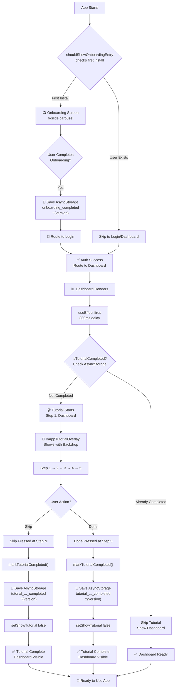
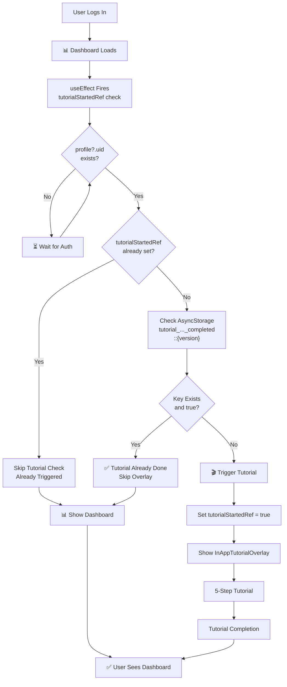
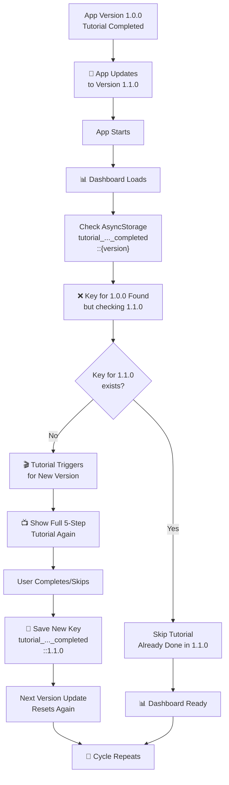
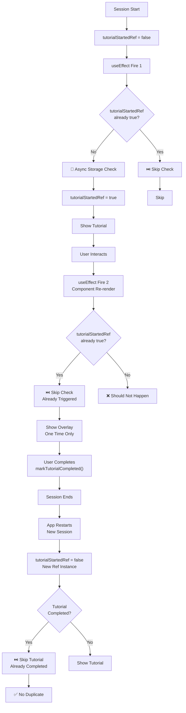

# Runtime Integration Flow Diagrams

## 1. Fresh Install Flow (First-Time User)



## 2. Returning User Flow (Same Version)



## 3. Version Update Flow



## 4. Duplicate Prevention Mechanism



## 5. Complete User Journey

```
┌─────────────────────────────────────────────────────────────────┐
│                    FIRST-TIME USER JOURNEY                      │
└─────────────────────────────────────────────────────────────────┘

Day 1: Fresh Install
├─ [1] App Starts
│  └─ Onboarding Entry Check
│     └─ First Install → Show Onboarding (6 slides)
│        ├─ Slide 1: Welcome
│        ├─ Slide 2: Live Classes
│        ├─ Slide 3: Audio Lessons
│        ├─ Slide 4: Attendance & Quiz
│        ├─ Slide 5: Islamic Tools
│        └─ Slide 6: Get Started
│
├─ [2] User Completes Onboarding
│  └─ onboarding_completed::1.0.0 ← Saved
│     └─ Route to /auth/login
│
├─ [3] User Creates Account & Logs In
│  └─ Dashboard Loads
│     ├─ useEffect fires (800ms delay)
│     ├─ Checks: isTutorialCompleted()
│     └─ NOT FOUND → Trigger Tutorial
│        └─ Show InAppTutorialOverlay
│           ├─ Step 1: Dashboard
│           ├─ Step 2: Courses  
│           ├─ Step 3: Live Classes
│           ├─ Step 4: Notifications
│           └─ Step 5: More → Applications
│
├─ [4] User Presses "Done"
│  └─ markTutorialCompleted()
│     └─ tutorial_..._completed::1.0.0 ← Saved
│        └─ InAppTutorialOverlay Dismissed
│
└─ [5] Dashboard Ready
   └─ User can explore app fully

────────────────────────────────────────────────────────────────

Day 2: Returning User (Same Version)
├─ [1] User Logs Back In
│  └─ Dashboard Loads
│     ├─ useEffect fires
│     ├─ Checks: isTutorialCompleted()
│     └─ FOUND → Skip Tutorial
│        └─ Show Dashboard Directly
│
└─ [2] Normal Dashboard Experience
   └─ No Tutorial Overlay

────────────────────────────────────────────────────────────────

Week Later: App Update to v1.1.0
├─ [1] User Updates App
│  └─ Dashboard Loads
│     ├─ useEffect fires
│     ├─ Checks: isTutorialCompleted() for v1.1.0
│     └─ NOT FOUND (only old v1.0.0 key exists)
│        └─ Trigger Tutorial AGAIN
│           └─ Show Full 5-Step Tutorial
│
├─ [2] User Completes Tutorial
│  └─ tutorial_..._completed::1.1.0 ← Saved (New Key)
│     └─ InAppTutorialOverlay Dismissed
│
└─ [3] Dashboard Ready for v1.1.0
   └─ Tutorial won't show again until next version

────────────────────────────────────────────────────────────────

Storage Timeline:
┌──────────────────┬─────────────────────────────────┐
│ Event            │ AsyncStorage Keys               │
├──────────────────┼─────────────────────────────────┤
│ Fresh Install    │ (empty)                         │
│ Complete Onboard │ onboarding_completed::1.0.0     │
│ Complete Tutorial│ tutorial_...::1.0.0             │
│ Update to v1.1.0 │ onboarding_completed::1.0.0     │
│                  │ tutorial_...::1.0.0             │
│ Complete v1.1.0  │ tutorial_...::1.0.0             │
│ Tutorial         │ tutorial_...::1.1.0 ← New Key   │
└──────────────────┴─────────────────────────────────┘
```

## Key Points

✅ **One-Time Per Version**: Tutorial shows only once per app version  
✅ **Persistent Across Logout**: AsyncStorage key survives logout/login  
✅ **Version-Based Reset**: Updating app version resets tutorial for that version  
✅ **No Duplicate Triggers**: tutorialStartedRef prevents multiple checks in same session  
✅ **Smooth UX**: 800ms delay lets dashboard render before overlay shows  
✅ **Error Resilient**: AsyncStorage errors caught and ignored gracefully  
